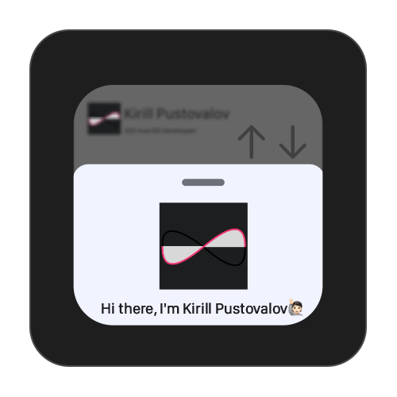
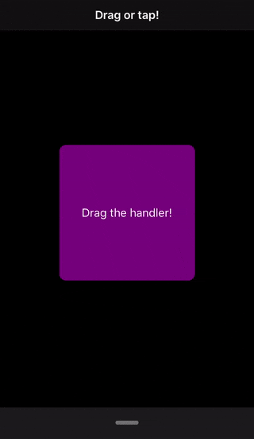

# BottomSheet
Bottom sheet popover built with Swift & UIKit

<p align="center">  


## Installation

### Manually
If you prefer not to use any dependency managers, you can integrate TelegramColorPicker into your project manually by downloading the desired release and copying the `Sources` directory.

## Usage

### Creation
Subclass `BottomSheetViewController`, then override viewDidLoad like this:
```swift
class ViewController: BottomSheetViewController {
    override func viewDidLoad() {
        viewController = BottomSheetContentsViewController() //your view controller
        super.viewDidLoad()
    }
}
```
Note that `super.viewDidLoad()` must be called after you set viewController property.

### Animation Duration
To change animation duration set `animationDuration` property.

### Popover Start & End Height
To modify popover startHeight & endHeight call `setupSizeWith(startHeight: CGFloat, endHeight: CGFloat)` function.

## Behaviour
BottomSheet recognizes taps on the handler and recognizes swipes across the entire view.
In addition, BottomSheet analyzes how fast you swipe and where you swipe. This means that if you swipe slowly and the swipe endpoint is less than half of the popup's height, the presentation will be canceled. If you swipe quickly, the popup will always be presented.

## Example
This repository contains example where you can [see how](Example/ViewController.swift) BottomSheet can be used for presenting Apple Music player popover.
<p align="center">  

</p>

## License
BottomSheet is available under the MIT license, see the [LICENSE](LICENSE) file for more information.
